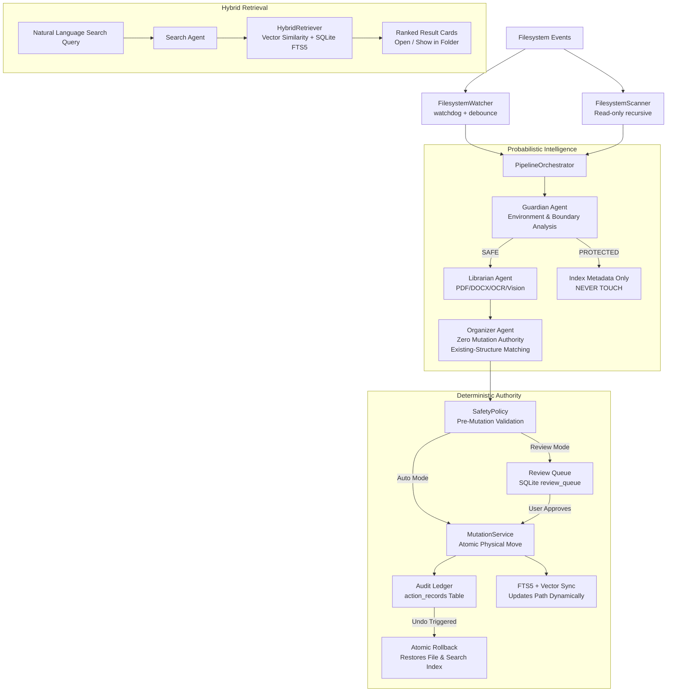

# TidyOS

**Your filesystem, intelligently organized.**

> *"Your files organize themselves, and you find them by what you remember, not where you put them."*

TidyOS is a local-first autonomous filesystem agent that understands, organizes, and retrieves your files while knowing what it must never touch.

---

## The Problem

People remember what files **mean**, not where they saved them.

Every day, downloads folders fill up with cryptic names (`document (17).pdf`, `Screenshot_20260912.png`, `resume_final_3.pdf`). Traditional file managers require constant manual upkeep, while cloud-sync tools simply mirror the mess without understanding it.

Meanwhile, autonomous AI agents that touch files directly are notoriously dangerous: an agent that misunderstands a developer workspace can delete build artifacts or break software projects.

---

## What TidyOS Does

- **Understands Content & Multimodal Assets**: Extracts text from PDFs, DOCX, text files, and images (OCR + Vision) to understand file semantics, document types, entities, and dates.
- **Natural Language Semantic Search**: Finds files by human memory ("Find the PDF about the agent hackathon I'm attending today" or "Find the screenshot where FastAPI had the CORS error") using hybrid vector retrieval and SQLite FTS5.
- **Safely Organizes Files**: Proposes concise, informative filenames (`Vercel_Invoice_September_2026.pdf`) and routes files into existing folder hierarchies.
- **Protects Structured Environments**: Automatically detects and locks software repositories (Next.js, Python, Git, Node).
- **Watches for New Files**: Monitors approved intake folders in the background and stabilizes downloads before processing.
- **Audit Ledger & 1-Click Rollback**: Every move is recorded in a local SQLite ledger and can be completely reversed with a single click on **Undo**.

---

## Why TidyOS Is Different: "The Filesystem is the Agent's Environment"

Most AI knowledge and desktop systems follow a simple pipeline:
$$\text{INGEST} \longrightarrow \text{INDEX} \longrightarrow \text{RETRIEVE} \longrightarrow \text{ANSWER}$$

TidyOS operates as an active environment agent:
$$\text{OBSERVE} \longrightarrow \text{UNDERSTAND} \longrightarrow \text{REASON} \longrightarrow \text{SAFELY ACT} \longrightarrow \text{REMEMBER}$$

### The Environmental Contrast Invariant

A file cannot be safely understood from its contents alone. Its surrounding directory structure fundamentally dictates what an autonomous agent is allowed to do.

| File Location | Classification | Agent Behavior |
|---|---|---|
| `Downloads/invoice.pdf` | **SAFE INTAKE** | TidyOS understands the invoice, matches existing folders (`Documents/Finance/Invoices/Vercel`), proposes renaming, and reorganizes it safely. |
| `Projects/storefront/public/invoice.pdf` | **PROTECTED PROJECT** | TidyOS indexes the file for semantic search, but `SafetyPolicy` **strictly forbids** moving or renaming it because it is a runtime asset inside a Next.js application. |

**The same file produces a different action depending on its environment.**

---

## Core Safety Invariant: Probabilistic Intelligence, Deterministic Authority

- **AI proposes, deterministic software authorizes.**
- LLMs (OpenAI / OpenRouter) and local heuristics are used for probabilistic understanding, classification, and naming.
- An LLM has **zero mutation authority**.
- All physical filesystem mutations are gated by `SafetyPolicy` and executed exclusively through `MutationService`.
- **Fail-Closed Guarantee**: Missing permissions, ambiguous boundaries, destination collisions, and system folders unconditionally result in rejection (`DENY`). Permanent file deletion is strictly disabled.

---

## Architecture



---

## Technology Stack

- **Desktop Framework**: PySide6 (Qt for Python), custom dark-mode theme
- **Agent Orchestration**: LangGraph, Pydantic v2
- **Language Models**: OpenAI Python SDK with dual provider support (OpenAI + OpenRouter) and 100% offline heuristic fallback
- **Content Extractors**: PyMuPDF (`pymupdf`), `python-docx`, Pillow (`PIL`), Windows OCR / local vision fallback
- **Search & Storage**: SQLite with FTS5 virtual tables, ONNX Runtime for local vector embeddings, NumPy vector cosine ranking
- **Filesystem & Continuous Intake**: `watchdog` (threaded observer), `pathlib`, `shutil`

---

## Running Locally

### Prerequisites
- Windows 10 or Windows 11 (64-bit)
- Python 3.12 (64-bit)

### Setup & Installation

1. **Clone the repository**:
   ```powershell
   git clone https://github.com/mahadbaig2/TidyOS.git
   cd TidyOS
   ```

2. **Set up virtual environment & install dependencies**:
   ```powershell
   py -3.12 -m venv .venv
   .\.venv\Scripts\Activate.ps1
   pip install -e ".[full,dev]"
   ```

3. **Configure Environment (Optional)**:
   TidyOS works 100% offline with deterministic heuristics, local Windows OCR, and local embeddings. To optionally enable frontier LLM reasoning via OpenAI or OpenRouter:
   Create a `.env` file in the root directory:
   ```env
   # Option A: Direct OpenAI
   OPENAI_API_KEY=sk-...
   AI_MODEL=gpt-4o-mini

   # Option B: OpenRouter
   OPENAI_API_KEY=sk-or-v1-...
   OPENAI_BASE_URL=https://openrouter.ai/api/v1
   AI_MODEL=openai/gpt-4o-mini
   ```

4. **Verify installation**:
   ```powershell
   pytest tests/test_mutation_and_watch.py tests/test_organizer_naming.py tests/test_ui_smoke.py -q
   ```

---

## How to Run: Two Modes

### Mode 1: Real-World Launch (Your Actual Files)

Organize your everyday `Downloads`, `Desktop`, `Screenshots`, or custom project folders:

1. **Launch TidyOS**:
   ```powershell
   tidyos
   # or: python -m tidyos.main
   ```

2. **Configure Your Managed Folders**:
   - Navigate to **Settings** (⚙️ gear icon in sidebar).
   - In **Managed Directories**, add the folders you want TidyOS to watch (e.g., `C:\Users\<You>\Downloads`, `C:\Users\<You>\Desktop`, `C:\Users\<You>\Pictures\Screenshots`).
   - TidyOS automatically starts a background scan, understands your files with the Librarian agent, and indexes them into the vector/FTS search engine.

3. **Background Continuous Watch Mode**:
   - When **Watch Mode** is enabled (default), drop any file into your watched folders.
   - **Zero manual intervention required**:
     - The debounced filesystem watcher picks up the file.
     - Content is extracted and analyzed (PDF text, Word documents, images via OCR).
     - Semantic topic hierarchies are identified (e.g., Networking materials are placed into `Documents/Computer Science/Networking/`, financial statements into `Documents/Finance/`, etc.).
     - The file is organized and **automatically indexed for search** immediately.

4. **Organize Workflow (Review vs Auto Mode)**:
   - **Review Mode (Default)**: TidyOS proposes changes and surfaces them in **Organize** (`Fix My Mess`), allowing 1-click inspection, batch approval, or rejection.
   - **Auto Mode**: Enabled via Settings for instant autonomous reorganization with guaranteed safety guardrails.
   - **Instant Undo**: Any move can be rolled back at any time from the **Activity** tab with a single click.

---

### Mode 2: 2-Minute Hero Demo Sandbox

Experience the complete end-to-end benchmark in an isolated sandbox without touching your personal files:

1. **Reset Demo Environment**:
   ```powershell
   python scripts/reset_demo.py
   ```
   This generates a self-contained `TidyOS_Demo/` folder containing benchmark test files (messy invoices, research PDFs, screenshots, resumes) and a protected Next.js codebase.

2. **Launch TidyOS**:
   ```powershell
   tidyos
   ```

3. **First-Run Onboarding**:
   - Click **Get Started** on the Welcome Screen.
   - Select the `TidyOS_Demo` folders (`Downloads`, `Documents`, `Projects`) and click **Analyze My Files**.
   - Watch the multi-stage background progress without any UI blocking.
   - The **Workspace Summary** highlights indexed assets and the detected **PROTECTED ENVIRONMENT: storefront (Next.js)**.
   - Click **Review Cleanup Plan** to enter **Fix My Mess**.

4. **Fix My Mess (Controlled Agency)**:
   - Inspect the proposal: `document (17).pdf` $\rightarrow$ `Vercel_Invoice_September_2026.pdf` targeting `Documents/Finance/Invoices/Vercel`.
   - Click **Approve Move**. TidyOS physically moves and renames the file on disk.
   - Click **Open TidyOS**.

5. **Search by Meaning (Hybrid Retrieval)**:
   - Search: `"Find the Vercel invoice from September."`
     $\rightarrow$ Found at its **new destination**.
   - Search: `"Find the PDF about the agent hackathon I'm attending today."`
     $\rightarrow$ Returns `document_42.pdf` as **Rank #1**.
   - Search: `"Find the screenshot where FastAPI had the CORS error."`
     $\rightarrow$ Returns `Screenshot_20260912.png` as **Rank #1**.
   - Search: `"Find my latest AI Product Engineering resume."`
     $\rightarrow$ Returns `resume_final_3.pdf` as **Rank #1**.

6. **Environmental Contrast**:
   - Search: `"storefront invoice"`
     $\rightarrow$ Returns `storefront/public/invoice.pdf` flagged as `🛡️ Protected Project`.
   - Reorganizing this file is safely prohibited by `SafetyPolicy`.

7. **Instant Undo**:
   - Go to **Activity**. Click **[ Undo ]** on the Vercel invoice move.
   - The file is instantly restored to `Downloads/document (17).pdf`.
   - Search immediately updates to reflect the restored path.

---


## Hackathon Disclosure

- **Pre-Hackathon Baseline**: Prior to the hackathon, work on this repository consisted of architecture research, design documentation, PRD planning, and a base PySide6 UI mockup interface with placeholder layouts.
- **Hackathon Deliverables**: All functional agents (Guardian, Librarian, Organizer, Search Agent), deterministic safety policy, content extractors (PDF, DOCX, Image/OCR), hybrid search engine (SQLite FTS5 + ONNX Runtime embeddings), continuous background Watch Mode, physical mutation engine, audit ledger, and full Undo restoration were designed, implemented, and verified entirely during the hackathon.
